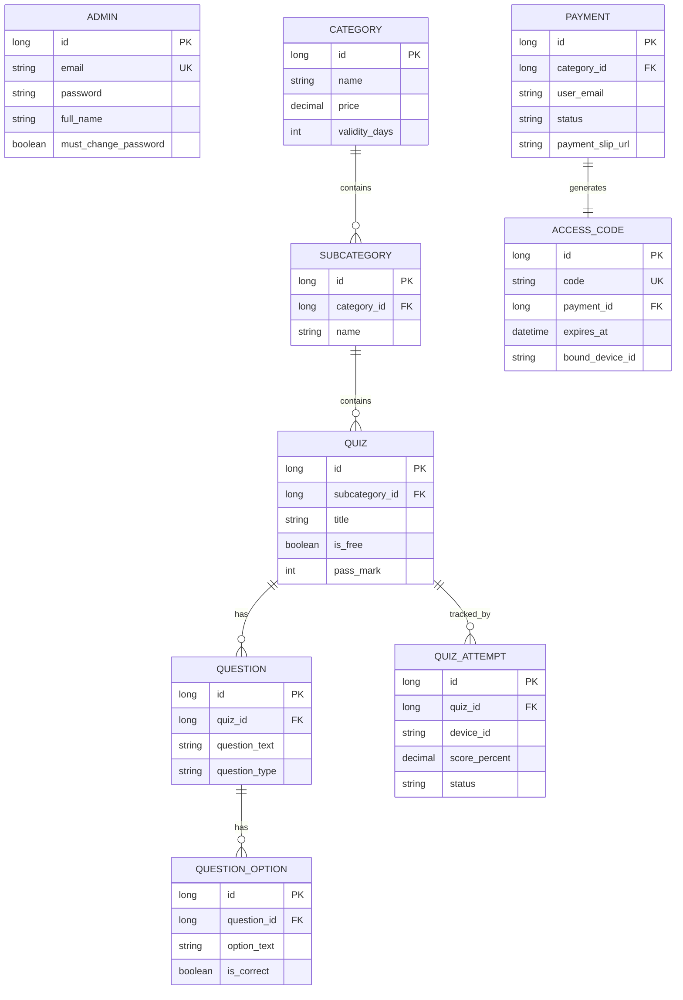

# Quiz App Backend - Spring Boot REST API

**Production-ready backend** for a modern mobile quiz application.

Built with **Spring Boot 3**, **Java 17**, and **PostgreSQL**, this REST API serves as the complete backend for quiz, trivia, or educational mobile applications (iOS & Android).

## 🛠 Tech Stack

- **Framework**: Spring Boot 3
- **Language**: Java 17
- **Database**: PostgreSQL
- **Build Tool**: Maven
- **Containerization**: Docker
- **CI/CD**: Jenkins + GitHub Webhooks
- **Documentation**: Swagger/OpenAPI
- **Security**: JWT-based Authentication

---

# 🚀 Setup & Run Instructions

## 1. Prerequisites

Ensure the following software is installed:

- Java 17 or higher
- Maven 3.8+
- PostgreSQL 14+
- Docker (optional, for containerized deployment)
- SMTP credentials (optional, for email notifications)

---

## 2. Database Setup

Create a PostgreSQL database:

```sql
CREATE DATABASE quizapp_db;
```

Update the database connection details in:

```text
src/main/resources/application.yml
```

---

## 3. Application Configuration

Configure the following properties in `application.yml`:

### Database

```yaml
spring:
  datasource:
    url: jdbc:postgresql://localhost:5432/quizapp_db
    username: your_username
    password: your_password
```

### SMTP Email Configuration

```yaml
spring:
  mail:
    host: smtp.example.com
    port: 587
    username: your_email@example.com
    password: your_password
```

### JWT Configuration

```yaml
app:
  jwt:
    secret: YOUR_BASE64_SECRET_KEY
```

> Use a strong, randomly generated Base64 secret in production.

### File Upload Configuration

```yaml
app:
  file:
    upload-dir: uploads
```

---

## 4. Running the Application

### Option 1: Run with Maven

```bash
mvn spring-boot:run
```

### Option 2: Build and Run

```bash
mvn clean package
java -jar target/quiz-app-backend.jar
```

### Option 3: Run with Docker

```bash
docker-compose up --build
```

Application will be available at:

```text
http://localhost:8080
```

---

## 5. API Documentation

### Swagger UI

```text
http://localhost:8080/swagger-ui.html
```

### OpenAPI JSON

```text
http://localhost:8080/v3/api-docs
```

---

# 🔑 Default Admin Credentials

| Field | Value |
|---------|---------|
| Email | admin@quizapp.com |
| Password | Admin@123 |

> ⚠️ The administrator must change the password on first login using:

```text
POST /api/auth/change-password
```

---

# ✨ Key Features

## Authentication & Security

- JWT-based authentication
- Secure login and logout
- Password reset via email
- First-login password change enforcement

## Category & Subcategory Management

- Category creation and maintenance
- Subcategory hierarchy support
- Pricing configuration
- Access validity management

## Quiz Management

- Create free and paid quizzes
- Configurable pass marks
- Quiz publishing controls

## Question Management

Supports:

- Single Choice Questions (SCQ)
- Multiple Choice Questions (MCQ)

Features:

- Multiple answer options
- Correct answer validation
- Rich quiz structure

## Quiz Attempt Tracking

- User attempt history
- Score calculation
- Pass/fail determination
- Performance tracking

## Payment Processing

- Payment slip upload
- Admin verification workflow
- Payment approval/rejection

## Access Code Management

- Unique 8-digit access codes
- Device ID binding
- Expiration control
- Secure content access

## Admin Dashboard APIs

- User management
- Quiz management
- Payment management
- Category management
- Reporting endpoints

## Production Ready Features

- Docker containerization
- CI/CD support
- Global exception handling
- Centralized logging
- API documentation
- Clean architecture

---

# 📊 Database Design (ER Diagram)



---

# 🚀 CI/CD & Deployment

## Continuous Integration

- Maven-based automated builds
- Unit and integration test execution
- GitHub Webhook triggers

## Continuous Deployment

- Jenkins Pipeline integration
- Docker image creation
- Automated deployment support

### Deployment Flow

```text
GitHub Push
     │
     ▼
GitHub Webhook
     │
     ▼
Jenkins Pipeline
     │
     ▼
Maven Build & Tests
     │
     ▼
Docker Image Build
     │
     ▼
Deployment
```

---

# 📁 Project Structure

```text
src
├── main
│   ├── java
│   │   └── com.quizapp
│   │       ├── controller
│   │       ├── service
│   │       ├── repository
│   │       ├── entity
│   │       ├── dto
│   │       ├── security
│   │       ├── config
│   │       └── exception
│   └── resources
│       ├── application.yml
│       └── db
└── test
```

---

# 🐳 Docker Support

Build image:

```bash
docker build -t quiz-app-backend .
```

Run container:

```bash
docker run -p 8080:8080 quiz-app-backend
```

---

# 📄 License

This project is intended as a backend foundation for:

- Quiz Applications
- Educational Platforms
- Certification Systems
- Online Examination Systems
- Trivia Applications

---

## 🎯 Summary

This backend provides a complete, production-ready foundation for modern quiz and educational applications with:

- Spring Boot 3
- Java 17
- PostgreSQL
- JWT Security
- Docker
- Jenkins CI/CD
- Swagger Documentation
- Payment & Access Code Management
- Quiz Attempt Tracking

**Perfect foundation for any quiz, trivia, educational, or examination mobile application.**
